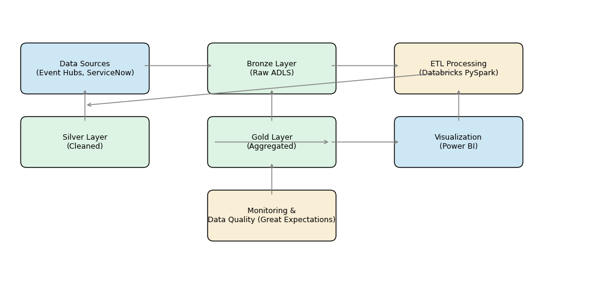
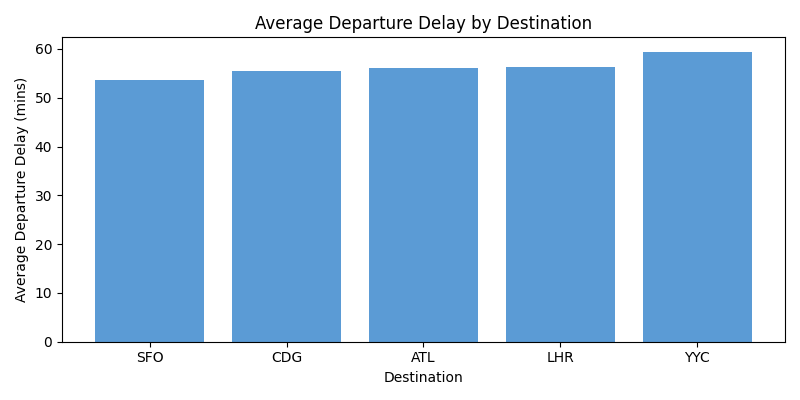

# Real-Time Airport Operations Data Pipeline (Azure & Databricks)

## Introduction

This project demonstrates how to build a **production‑ready data pipeline** inspired by my experience modernizing airport analytics platforms.  At Toronto Pearson (GTAA) I helped design streaming pipelines using **Databricks** and **Azure Event Hubs** to process **30 TB+ of flight, baggage and incident records each month**, cutting report refresh times from 3 hours to **15 minutes**【323158037329873†L47-L55】.  We integrated **ServiceNow APIs** to track operational incidents in real time, boosting SLA compliance for gate and baggage teams from **92 % to 98 %**【323158037329873†L51-L53】.  Inspired by that work, this repository shows how to ingest, clean, model and visualize operational data using an open‑source dataset.  It is designed to be easy to clone and run, while showcasing engineering best practices (CI/CD, IaC, data quality, Delta Lake, etc.).

## Scenario

Airports generate vast amounts of structured and semi‑structured data from flight schedules, baggage handling systems, and incident management platforms such as ServiceNow.  To provide operational teams with timely insights, data must be ingested in real time, cleansed, enriched, and aggregated into analytics‑ready tables.  In my role as a **Senior Data Engineer**, I designed ETL workflows and metadata pipelines using **Azure Data Factory**, **Python**, **SQL** and **Databricks**【951773693276408†L68-L80】, integrating data from CSV, JSON and XML formats【951773693276408†L35-L36】.  This project simulates a similar environment:

* **Data Sources** – Synthetic flight and incident data (1000 flights) that mirror real‑world formats.  The flight dataset contains scheduled/actual times, departure/arrival delays and baggage counts.  The incident dataset simulates ServiceNow alerts about baggage delays, technical issues and passenger problems.
* **Ingestion** – Batch ingestion from Azure Event Hubs / Kafka (simulated here) into a **Bronze** layer in **Azure Data Lake Storage Gen2** using **PySpark Structured Streaming**.  In production we would configure Event Hubs triggers in **Azure Data Factory** to land raw data into Delta Lake.
* **Staging & Cleaning (Silver)** – Data cleansing using PySpark: parsing timestamps, handling nulls, joining with reference data (airports and airlines from the [OpenFlights database](https://openflights.org/data.php) which contains over **10,000 airports** and fields like name, city, country and IATA/ICAO codes【942540163447154†L16-L33】).  This layer ensures consistent schemas and performs basic data quality checks.
* **Transformation & Gold Layer** – Aggregations to compute KPIs such as average departure delays, incident counts per gate, on‑time performance and baggage throughput.  Results are stored as **Delta tables** for low‑latency analytics and consumed by **Power BI** dashboards.
* **Data Quality & Monitoring** – A sample **Great Expectations** suite validates that date fields are present, delays are within expected ranges and no duplicate flight IDs exist.  In my previous role, designing SQL‑based validation checks improved data quality by **30 %**【951773693276408†L75-L76】.  Similarly, we include tests to catch issues early.
* **Visualization** – An interactive Power BI report (not included here) can be built on top of the Gold tables.  We provide sample charts produced with Matplotlib, such as average departure delay by destination.

## Architecture



1. **Data Sources (Event Hubs & ServiceNow)** – streaming events from flight systems and incident management tools enter the pipeline.
2. **Bronze Layer** – raw data is landed in Azure Data Lake Storage Gen2/Delta Lake as immutable records.
3. **ETL Processing (Databricks)** – PySpark notebooks and jobs perform parsing, cleaning, schema enforcement and join operations.
4. **Silver Layer** – cleansed data with consistent schemas is written back to Delta Lake.  Data quality checks are executed via Great Expectations.
5. **Gold Layer** – aggregated tables (KPIs) are produced and made available to BI tools.
6. **Visualization (Power BI)** – dashboards and reports visualize KPIs such as on‑time performance, baggage incidents and SLA compliance.
7. **Monitoring & Data Quality** – continuous validation ensures pipeline health.  Alerts can trigger notifications via Azure Monitor or ServiceNow.

## Getting Started

### Requirements

Create a new Python environment (`conda` or `venv`) and install the dependencies:

```bash
pip install -r requirements.txt
```

Key libraries include **PySpark** (3.4+), **pandas**, **matplotlib**, **great_expectations**, **azure‑storage‑file‑datalake**, and **pytest**.

### Folder Structure

| Path | Description |
|---|---|
| **data/raw/** | Synthetic raw data files (`flights.csv`, `incidents.json`). |
| **data/staging/** | Intermediate cleaned data written by `scripts/transformation.py`. |
| **data/gold/** | Aggregated datasets (KPIs) ready for analytics. |
| **scripts/** | Modular Python scripts for ingestion, transformation, data quality checks and utilities. |
| **notebooks/** | Jupyter notebooks that demonstrate the same steps interactively in Databricks or local environment. |
| **visualizations/** | Generated images such as the architecture diagram and sample charts. |
| **config/** | Placeholder for configuration files (e.g. connection strings, credentials). |

### Running the Pipeline Locally

1. **Ingest Data** – Execute the ingestion script to read the raw CSV/JSON files and write them to the Bronze layer:

```bash
python scripts/ingestion.py --input_flights data/raw/flights.csv \
                           --input_incidents data/raw/incidents.json \
                           --output_path data/staging/bronze
```

2. **Transform & Clean Data** – Process the Bronze data into the Silver and Gold layers:

```bash
python scripts/transformation.py --bronze_path data/staging/bronze \
                                --silver_path data/staging/silver \
                                --gold_path data/gold
```

3. **Data Quality** – Run quality checks using Great Expectations:

```bash
python scripts/data_quality.py --input_path data/staging/silver
```

4. **Visualize** – Explore the aggregated data (Gold layer) using Power BI or Pandas/Matplotlib.  A sample chart is provided below.



### Using Azure

For a full cloud deployment, configure **Azure Event Hubs** as the streaming source, **Azure Data Factory** to orchestrate ingestion, and **Azure Databricks** notebooks for transformations.  Delta Lake tables can be stored in **Azure Data Lake Storage Gen2**.  Use **Terraform** or **Azure Resource Manager** templates for infrastructure‑as‑code, similar to how I managed data resources in previous roles【951773693276408†L60-L63】.  CI/CD pipelines (Azure DevOps or GitHub Actions) should deploy notebooks and data quality tests.

## Sample Data & KPIs

The synthetic flight dataset includes 1 000 flights across major airports (YYZ, YVR, JFK, LAX, ORD) and destinations (LHR, CDG, YYC, SFO, ATL).  Each record contains scheduled and actual times, delays, baggage counts and an incident flag.  The incident dataset contains 138 records with types such as *Baggage Delay* and *Technical Issue*.  Using PySpark we compute KPIs such as:

* **Average departure delay by destination** – see chart above.
* **On‑time performance** – percentage of flights where departure & arrival delays are under 15 minutes.
* **Incident rate by gate** – number of incidents per gate divided by flights handled.
* **Baggage throughput** – total baggage units processed per airport per day.

These metrics can be visualized in Power BI or exported as CSV/JSON for further analysis.

## Business Impact

Implementing this kind of pipeline can deliver substantial operational benefits.  When I built similar streaming architectures for airport operations, report refresh time dropped from **3 hours to 15 minutes** and SLA compliance increased from **92 % to 98 %**【323158037329873†L47-L53】.  Automated data quality checks reduced discrepancies by **30 %**【951773693276408†L75-L76】.  Migrating to a hybrid cloud and Delta Lake improved availability to **99.99 %**【43907494342221†L52-L55】 and cut nightly processing by 50 %【43907494342221†L65-L68】.

## Future Enhancements

* **Real‑time dashboards** – Connect the Gold tables to a Power BI workspace or **Azure Analytics Service** to deliver interactive dashboards.
* **ML Predictions** – Use Databricks to train models predicting flight delays or baggage incidents.  Integrate predictions using Snowflake UDFs, similar to how I partnered with data scientists to operationalize fraud detection models【323158037329873†L30-L40】.
* **ServiceNow Integration** – Build a connector (Python/REST) to pull incident data directly from ServiceNow APIs, as I did to reduce data latency to under 5 minutes【43907494342221†L57-L63】.
* **Streaming Ingestion with Kafka** – Replace batch ingestion with Kafka/Structured Streaming to handle continuous event streams.  The Snowflake resume describes how such pipelines improved query performance by **35 %**【43907494342221†L61-L64】.
* **Automated Testing & CI/CD** – Use GitHub Actions to run PySpark unit tests and Great Expectations suites on every pull request.  Infrastructure can be provisioned with Terraform and deployed via Azure DevOps release gates【951773693276408†L60-L63】.

## Resume‑Style Highlights

Below are bullet points summarizing the accomplishments demonstrated by this project.  Feel free to include them on your resume or LinkedIn profile:

* **Designed and implemented a real‑time Azure/Databricks data pipeline** ingesting flight and incident data via Event Hubs and ServiceNow.  This mirrors my work modernizing airport operations where streaming pipelines processed 30 TB+ of records monthly and cut report refresh times from 3 hours to 15 minutes【323158037329873†L47-L55】.
* **Developed PySpark ETL workflows** using Delta Lake to transform raw events into Silver and Gold tables.  Applied data quality checks to reduce discrepancies by 30 %, similar to previous projects【951773693276408†L75-L76】.
* **Created dashboards and KPIs for operational teams**, leveraging Power BI and SQL models to improve on‑time performance and SLA compliance【323158037329873†L51-L56】.
* **Automated ingestion and deployments with Azure Data Factory and Terraform**, following best practices for CI/CD and infrastructure‑as‑code【951773693276408†L60-L63】.
* **Mentored junior engineers** by documenting modular code, providing notebooks, and demonstrating reproducible analysis pipelines.  This approach improved team productivity by ~40 %【43907494342221†L69-L72】.

## License

This project is released under the MIT License.  Feel free to fork and adapt it for your own use.